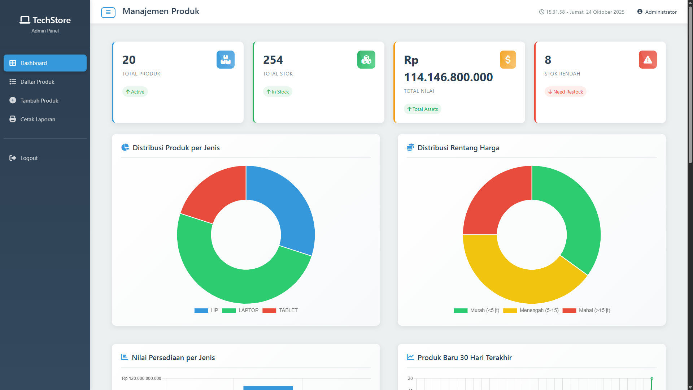
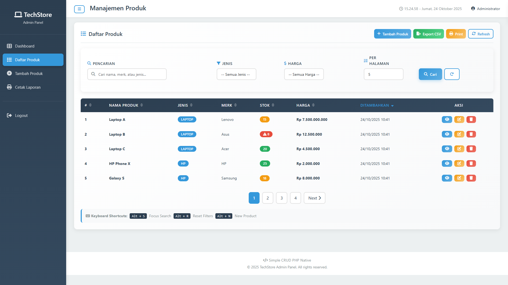
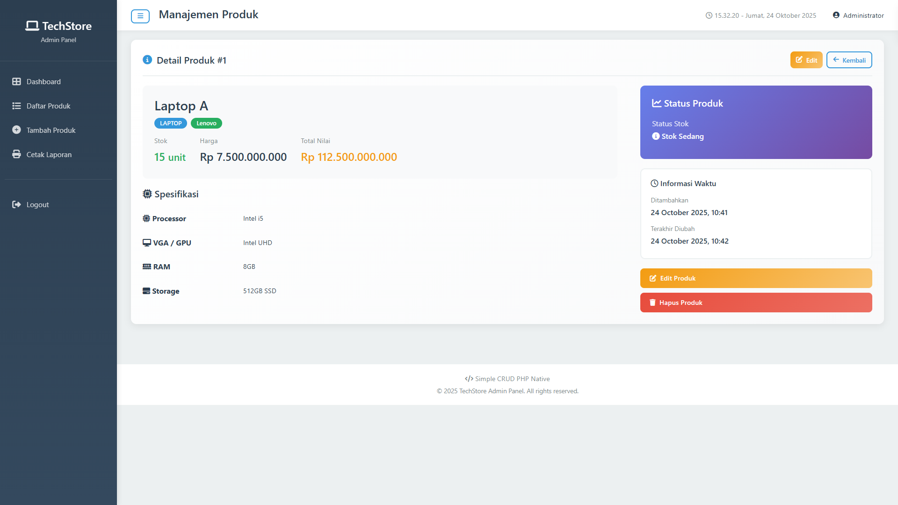
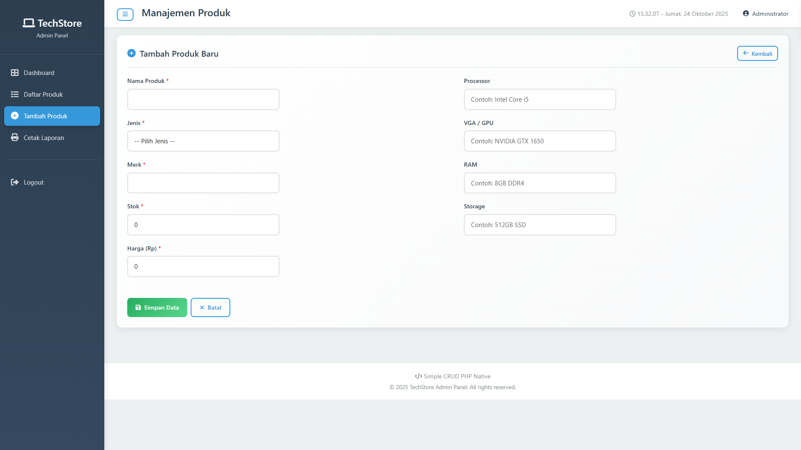
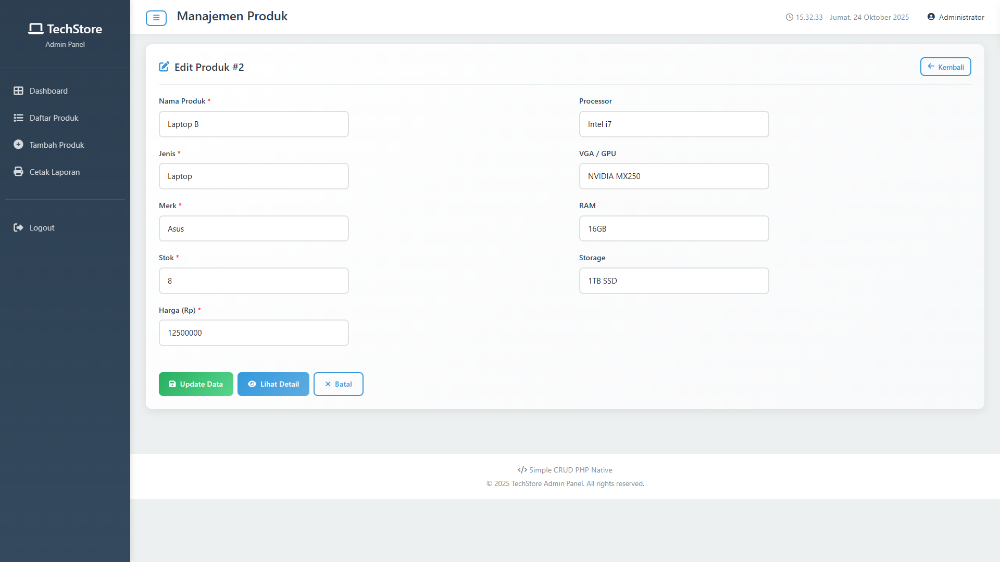

# CRUD Laptop - TechStore Admin

Simple CRUD (Create, Read, Update, Delete) aplikasi manajemen produk built with native PHP and PDO. Aplikasi ini ditujukan sebagai panel admin ringan untuk menyimpan data produk (laptop, smartphone, tablet) termasuk stok, harga, dan spesifikasi sederhana.

## Fitur

- Autentikasi (login / logout) dengan hashing password yang aman (password_hash). Kompatibilitas dengan legacy MD5 disediakan dan otomatis di-upgrade saat user login.
- Daftar produk lengkap dengan sorting, searching, filter (jenis, rentang harga), dan pagination.
- CRUD: Tambah, edit, lihat detail, dan hapus produk.
- Export CSV & Print view dari daftar produk.
- Dashboard statistik: total produk, total stok, total nilai inventori, distribusi per jenis, rentang harga, tren produk baru (Chart.js).
- Input harga/stok disanitasi dan divalidasi di server (helpers.php).
- CSRF token pada form login, session-based flash messages, dan protection middleware `require_login()`.
- Seed script `seed_user.php` untuk membuat database/tabel dan menambahkan 20 produk sampel + admin user.

## Kebutuhan Sistem

- PHP 7.4+ (disarankan PHP 8.x)
- MySQL / MariaDB
- Web server (Apache via XAMPP, WAMP, atau built-in PHP server untuk development)
- Ekstensi PDO MySQL diaktifkan
- Akses ke terminal (opsional) untuk menjalankan seeder: `php seed_user.php`

## Cara Instalasi & Konfigurasi (Quickstart)

1. Clone atau salin folder proyek ke direktori web server Anda, misal `C:\xampp\htdocs\crud-laptop`.
2. Pastikan MySQL berjalan (jika memakai XAMPP jalankan Apache & MySQL dari Control Panel).
3. Sesuaikan konfigurasi database di `db.php` jika perlu (host, nama DB, user, password). Default di repo:

```php
// db.php (contoh)
$DB_HOST = '127.0.0.1';
$DB_NAME = 'crud_produk_laptop';
$DB_USER = 'root';
$DB_PASS = ''; // sesuaikan jika Anda menggunakan password
$DB_CHARSET = 'utf8mb4';
```

4. Jalankan seeder untuk membuat database, tabel, sample data, dan admin user:

From PowerShell (project folder):

```powershell
php .\seed_user.php
```

Setelah berhasil Anda akan melihat pesan bahwa database dibuat dan 20 produk sampel ditambahkan.

5. Buka browser dan akses aplikasi: `http://localhost/crud-laptop/login.php`

Default admin credentials (development):

- Username: `admin`
- Password: `admin`

## Struktur Folder

Keterangan singkat struktur file di repo ini:

```
crud-tech-store/
├─ create.php        # Form tambah produk
├─ store.php         # Endpoint simpan produk (POST)
├─ edit.php          # Form edit produk
├─ update.php        # Endpoint update produk (POST)
├─ delete.php        # Endpoint hapus produk
├─ detail.php        # Halaman detail produk
├─ index.php         # Daftar produk (search, sort, filter, pagination)
├─ dashboard.php     # Dashboard statistik & charts
├─ login.php         # Halaman login
├─ logout.php        # Logout
├─ seed_user.php     # Seeder DB + sample data
├─ db.php            # Koneksi PDO (sesuaikan jika perlu)
├─ helpers.php       # Util functions, sanitasi & validasi
├─ auth.php          # Auth helpers (login, logout, csrf, require_login)
├─ style.css         # Custom CSS
├─ script.js         # Custom JS
├─ readme.md         # (Anda sedang melihatnya)
```

## Screenshot

Dashboard



Daftar Produk



Detail Produk



Tambah Produk



Edit Produk



## Keamanan & Catatan

- Password disimpan menggunakan `password_hash()` (secure). Script masih mendukung upgrade dari MD5 untuk akun legacy (otomatis di-upgrade saat login).
- Jangan gunakan kredensial default pada lingkungan produksi.
- Untuk deployment produksi: konfigurasi password database yang kuat, HTTPS, dan pembatasan akses.

## Troubleshooting

- Jika `seed_user.php` gagal, pastikan MySQL berjalan dan kredensial pada bagian atas file sesuai.
- Jika Chart.js tidak tampil, periksa koneksi internet karena library dimuat via CDN; Anda bisa mengunduhnya dan melokalkan file jika diperlukan.
